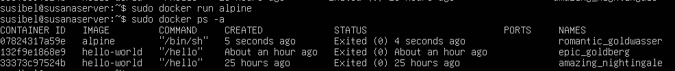
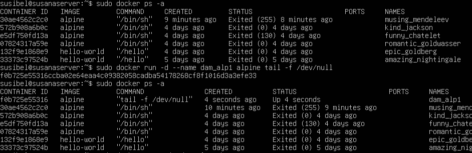

# Tarea2--SXE
### 1.- Descarga la imagen "alpine" SIN ARRANCARLA y comprueba que está en tu equipo
Descargamos la imagen iso en la máquina virtual con el comando:  

``docker pull alpine``

Se descarga la imagen en un repositorio Docker.

### 2.- Crea un contenedor sin ponerle nombre. ¿Está arrancado? Obtén el nombre
Usamos el comando:

``docker run alpine``

El contenedor está creado y para ver el nombre usamos otro comando que es:

``docker ps -a``

Este en el apartado NAMES indica el nombre del contenedor.

### 3.- Crea un contenedor con el nombre 'dam_alp1'. ¿Cómo puedes acceder a él?
Usamos el comando:

``sudo docker run -it --name dam_alp1 alpine tail -f /dev/null``

y verificamos con sudo docker ps -a. Para acceder primero tenemos que iniciarlo con el comando: 

``docker start f0b7``

Luego ejecutamos con el comando:

``docker exec -it dam_alp1 sh``

