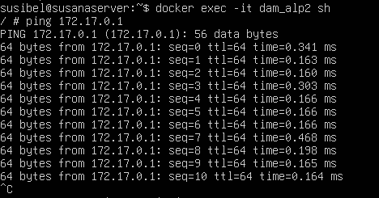
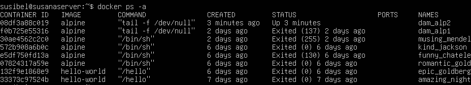

# Tarea2--SXE
### 1.- Descarga la imagen "alpine" SIN ARRANCARLA y comprueba que está en tu equipo
Descargamos la imagen iso en la máquina virtual con el comando:  

``docker pull alpine``

Se descarga la imagen en un repositorio Docker.

### 2.- Crea un contenedor sin ponerle nombre. ¿Está arrancado? Obtén el nombre
Usamos el comando:

``docker run alpine``

El contenedor está creado y para ver el nombre usamos otro comando que es:

``docker ps -a``

Este en el apartado NAMES indica el nombre del contenedor.

### 3.- Crea un contenedor con el nombre 'dam_alp1'. ¿Cómo puedes acceder a él?
Usamos el comando:

``sudo docker run -it --name dam_alp1 alpine tail -f /dev/null``

y verificamos con sudo docker ps -a. Para acceder primero tenemos que iniciarlo con el comando: 

``docker start f0b7``

Luego ejecutamos con el comando:

``docker exec -it dam_alp1 sh``

### 4.- Comprueba que ip tiene y si puedes hacer un ping a google.com
Al tener ejecutado el contenedor podemos entrar a su consola donde haremos un ping a google. Para entrar a su consola usamos los comandos: 

``docker exec -it dam_alp1 sh``

Dentro de la consola del contenedor hacemos el ping con los comandos:

``ping google.com``

Realiza correctamente el ping 

### 5.- Crea un contenedor con el nombre 'dam_alp2'. ¿Puedes hacer ping entre los contenedores?
Creamos el contenedor con el comando:

``docker run -it --name dam_alp2 alpine tail -f /dev/null``

Luego lo iniciamos con el comando:

``docker exec -it dam_alp2 sh``

En la consola del contenedor haremos el ping al contenedor de dam_alp1 con ip de este:

``ping 172.17.0.1``

### 6.- Sal del terminal, ¿qué ocurrió con el contenedor?
Para salir de la terminal es con el comando:

``shift+d``

El contenedor sigue ejecutandose si se desea parar se debe poner el comando:

``docker stop dam_alp2``

